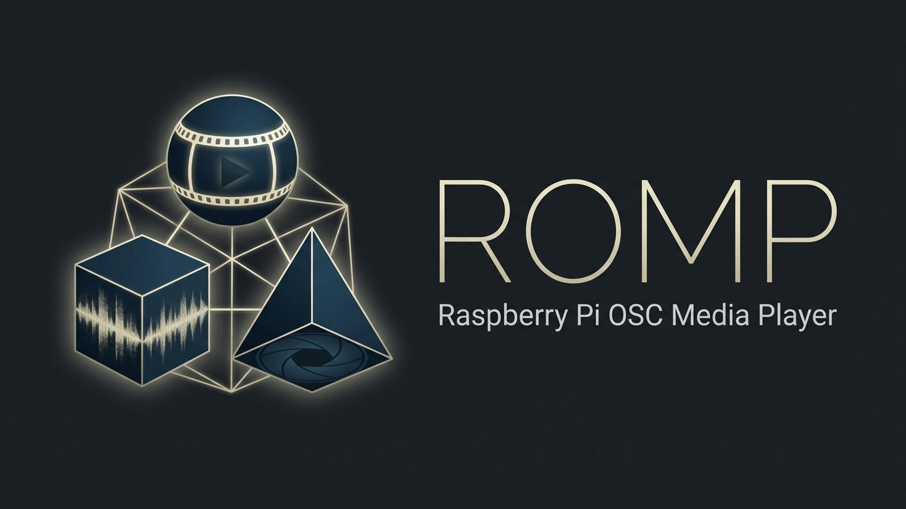

# ROMP — Raspberry OSC Media Player
 


## Overview
ROMP is a high-performance, lightweight media player designed specifically for the Raspberry Pi (optimized for RPi 4/5). It enables full remote control over video, audio, and image playback via the OSC (Open Sound Control) protocol.

Built on the **SDL3** and **FFmpeg** stacks, it features native hardware-accelerated decoding, professional gapless transitions (Fade In/Out, Crossfade), and a customizable indexing system for multi-device installations.

The player can be controlled either by targeting a specific device `index` or without any `index` at all — sending OSC commands to the global address will affect the running instance. This makes single-device setups and ad-hoc control simple and flexible.

Tested on: **Raspberry Pi OS Lite 64-bit (Trixie)**.

## Key Features
- **Hardware Acceleration**: Native V4L2M2M support for H.264 and HEVC.
- **Gapless Transitions**: Smooth Fade In, Fade Out, and Crossfade between media.
- **Audio Support**: Integrated audio playback from video files or standalone files (.mp3, .wav, .flac).
- **OSC Remote Control**: Full control over playback, speed, transitions, and info overlays.
- **Multi-Device Ready**: Unique indexing allows controlling specific units or global broadcast on the same network.
- **Auto-setup**: Automated installer with systemd service integration.

### Additional capabilities:
- **Media Types**: Play videos, audio and image slideshows (with configurable timing and transitions).
- **Playlist & Queue Control**: Queue multiple files, skip, loop, and manage ordered playback via OSC commands.
- **Overlays & Info**: Toggle on-screen overlays with status, filename and optional captions.
- **Playback Control**: Seek, set playback rate, and control looping and fade parameters remotely.

## Project Structure
```
romp
├── main.cpp                # Core application logic and rendering loop
├── video_player.cpp/h      # Video decoding and HW acceleration interfaces
├── utils.cpp/h             # OSC handling, configuration, and helpers
├── Makefile                # Build system configuration
├── install.sh              # Automated installer and data migration
├── install_dependencies.sh # Dependency installation script
├── setup.txt               # Configuration template
└── README.md               # Documentation
```

## Installation

The easiest way to install ROMP is by using the provided installation script:
```bash
sudo ./install.sh
```

The script handles dependency installation (if needed), compiles the project, installs the binary, and (if enabled during the process) sets up auto-start via systemd.

### Alternative Manual Installation

Installation using the Makefile or direct `g++` command (in the project root):
```bash
make
```

After installation/build, the `romp` binary will be available. If you use `install.sh`, the binary is installed to the system path and the service is configured for auto-start (see `romp.service` in the installer).

## Configuration
The program loads configuration from `setup.txt` in the working directory or from `~/.romp/setup.txt`. Supported keys:
- `index=` — Device ID (e.g., `1`)
- `address=` — OSC address prefix (default: `romp`)
- `osc_port=` — UDP port for OSC (default: `8000`)
- `path=` — Path to media files
- `width=`, `height=` — Window resolution
- `audio_device=` — Audio output device (e.g., `default`, `hdmi`, `jack`)
- `fadein=`, `fadeout=`, `cross=` — Default transition durations

Note: You can omit `index` to send commands to the single running instance (global control). When running multiple devices, use distinct `index` values to address a specific unit.

### Example `setup.txt`:
```text
index=tv
address=romp
width=1920
height=1080
osc_port=8000
path=/home/pi/media
audio_device=jack
fadein=2
fadeout=2
cross=2
```

## OSC Interface (Addresses and Examples)
The default OSC root address is `/romp`. The program supports addresses with a specific device ID as well as global variants.

| Command | Arguments | Description |
| :--- | :--- | :--- |
| `/<address>/<index>/play` | `string` filename, `string` "loop" (opt) | Play file |
| `/<address>/<index>/stop` | - | Stop and show black screen |
| `/<address>/<index>/pause` | - | Toggle pause |
| `/<address>/<index>/fadein` | `float` duration, `string` filename | Play with Fade-In |
| `/<address>/<index>/fadeout` | `float` duration (opt) | Stop with Fade-Out |
| `/<address>/<index>/cross` | `float` duration, `string` filename | Crossfade to new file |
| `/<address>/<index>/info` | - | Toggle status overlay |
| `/<address>/<index>/speed` | `float` multiplier | Set playback speed (0.1 - 4.0) |

*Example:* `oscsend 192.168.1.10 8000 /romp/1/play s "video.mp4"`
*Example (multicast):* `oscsend 192.168.1.255 8000 /romp/fadeout i 10`

## Deployment and Tips
- For kiosk deployment, use the systemd service or a Wayland kiosk (e.g., `cage`) in kiosk mode.
- Place `setup.txt` into `~/.romp/setup.txt` for persistent per-user configuration.

## Contributing and License
ROMP is open-source. If you improve the code, fix a bug, or add a feature, please share your changes back via a Pull Request! This project is licensed under the MIT License.

## Disclaimer
This program (and this project's documentation) was created with the assistance of AI. Use the software and documentation at your own risk — the author(s) provide no warranty and accept no responsibility for any damage, data loss, or other consequences arising from its use.